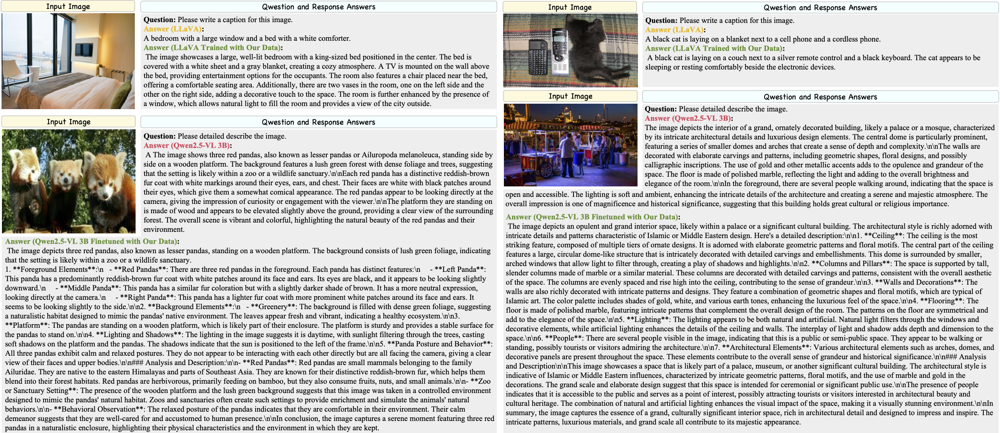
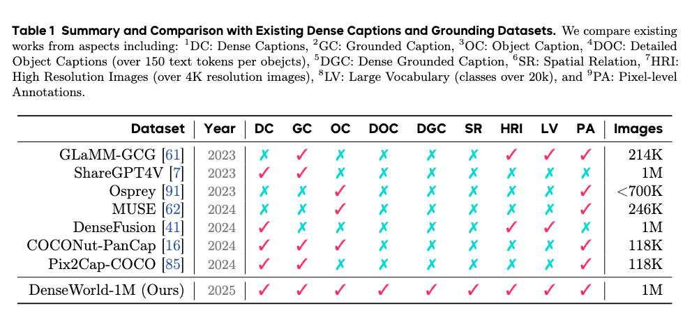
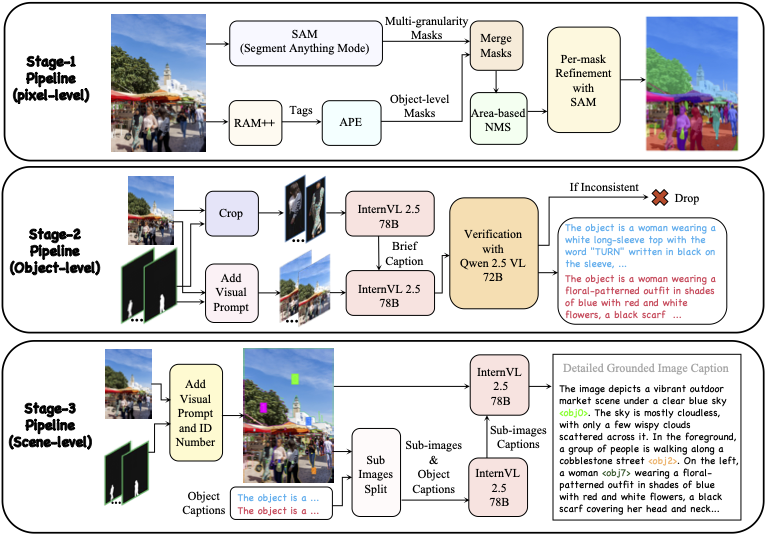
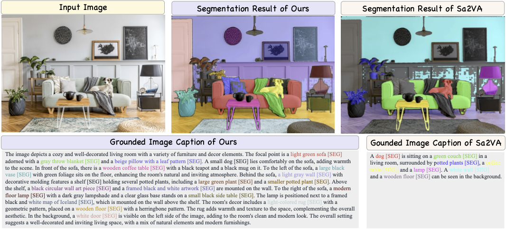

# DenseWorld-1M: Towards Detailed Dense Grounded Caption in the Real World


[\[🏠 DenseWorld-1M\]]()  [\[📜 arXiv\]](https://arxiv.org/abs/2506.24102) [\[🤗 HuggingFace\]](https://huggingface.co/datasets/ByteDance/) [\[🧑‍💻 GitHub\]](https://github.com/lxtGH/DenseWorld-1M) 


[**Xiangtai Li**](https://lxtgh.github.io/)<sup>1*</sup> · [**Tao Zhang**](https://zhang-tao-whu.github.io/)<sup>1*;</sup> · [**Yanwei Li**](https://yanwei-li.com/)<sup>1*</sup> · [**Zilong Huang**](http://speedinghzl.github.io/)<sup>1</sup> · [**Haobo Yuan**](https://yuanhaobo.me/)<sup>2</sup> · [**Yikang Zhou**](https://scholar.google.com/citations?user=dZikW2YAAAAJ&hl=en)<sup>2</sup> · [**Shihao Chen**]()<sup>2</sup> ·  
[**Jiahao Meng**]()<sup>3</sup> · [**Yueyi Sun**]()<sup>3</sup> · [**Shilin Xu**]()<sup>3</sup> · [**Lu Qi**](https://luqi.info/)<sup>1</sup> · [**Yi Lin**]()<sup>1</sup> ·[**Wenhao Huang**](https://scholar.google.com/citations?user=OdE3MsQAAAAJ&hl=zh-CN)<sup>1</sup> · [**Jiashi Feng**](https://scholar.google.com/citations?user=Q8iay0gAAAAJ&hl=en)<sup>1</sup> · [**Guang Shi**]()<sup>1</sup>

<sup>1</sup>Bytedance Seed&emsp;&emsp;&emsp;&emsp;<sup>2</sup>Wuhan University&emsp;&emsp;&emsp;&emsp;<sup>3</sup>Peking University&emsp;&emsp;&emsp;&emsp;

&dagger; project lead&emsp;* The first three authors equally contribute to the work.







### Introduction

Multimodal Large Language Models (MLLMs) demonstrate a complex understanding of scenes, benefiting from large-scale and high-quality datasets. Most existing caption datasets lack the ground locations and relations for visual entities. Several grounded caption datasets face the problems of missing detailed descriptions, relations, and massive object descriptions on high-resolution images. To fill this gap for the community, we present DenseWorld-1M, the first massive, detailed, dense grounded caption dataset in the real world. We design a three-stage labeling pipeline, containing open-world perception, detailed object caption generation, and dense caption merging. The first stage obtains entity-level masks and labels.
The second stage generates the object-level, detailed captions with the guidance of masks and labels from the first stage. The final stage merges object captions and masks into spatial and relational dense captions.
To accelerate the labeling process and improve caption quality, we present two VLM models: the Detailed Region Caption model and the Spatial Caption Merging model. Extensive experiments on various settings, including vision-language understanding, visual grounding, and region caption generation, demonstrate the effectiveness of our DenseWorld-1M dataset and labeling models.


### Visual Results




### News

- [x] The report is on arxiv.


### To Do List

We are cleaning the dataset and the open-source procedure is also still under review process.

We will opensource the entire DenseWorld-1M dataset before the end of July on Huggingface.

- [ ] Release training code for different model.
- [ ] Release dataset


## References

If you find this repository useful, please consider referring to the following paper:

```
@misc{li2025denseworld1m,
      title={DenseWorld-1M: Towards Detailed Dense Grounded Caption in the Real World}, 
      author={Xiangtai Li and Tao Zhang and Yanwei Li and Haobo Yuan and Shihao Chen and Yikang Zhou and Jiahao Meng and Yueyi Sun and Shilin Xu and Lu Qi and Tianheng Cheng and Yi Lin and Zilong Huang and Wenhao Huang and Jiashi Feng and Guang Shi},
      year={2025},
      eprint={2506.24102},
      archivePrefix={arXiv},
      primaryClass={cs.CV},
      url={https://arxiv.org/abs/2506.24102}, 
}
```


